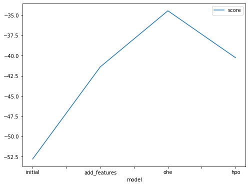
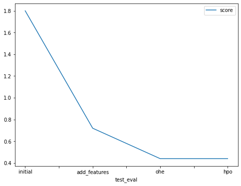

# Report: Predict Bike Sharing Demand with AutoGluon Solution
#### Youssef Kamil Adly

## Initial Training
### What did you realize when you tried to submit your predictions? What changes were needed to the output of the predictor to submit your results?
The prediction must not be negative and the column names must be the same of submissions.csv that came with kaggle compution 

### What was the top ranked model that performed?
 WeightedEnsemble_L3

## Exploratory data analysis and feature creation
### What did the exploratory analysis find and how did you add additional features?
1. Datatime column includes year, month, day, hour data that can be sperated. So I create seperate month and hour values
2. Season and weather are identified as int variable. I changed it to categorical data
3. After training with these categorical data, I've tried to change them to be one Hot encoding (season, weather, weekday), and this trick increase accuracy.

### How much better did your model preform after adding additional features and why do you think that is?
For the initial training the model has got 1.8, after adding features it has got 0.72, after adding ohe got 0.44
That because the type of problem can benfit very from date informations also changing weather and season to catgorical and ohe makes gloun use it in a propper way

## Hyper parameter tuning
### How much better did your model preform after trying different hyper parameters?
It performs better than the initial training, and also than the added feature training, but it seems to be equal with the ohe training 

### If you were given more time with this dataset, where do you think you would spend more time?
Feature Engineering and hyperparameter tunning

### Create a table with the models you ran, the hyperparameters modified, and the kaggle score.
|model|time_limit|presets|score|
|--|--|--|--|
|initial|600|best_quality|1.8|
|add_features|600|best_quality|0.72|
|Ohe|600|best_quality|0.44|
|hpo|1200|best_quality|0.44|

### Create a line plot showing the top model score for the three (or more) training runs during the project.

### Create a line plot showing the top kaggle score for the three (or more) prediction submissions during the project.

